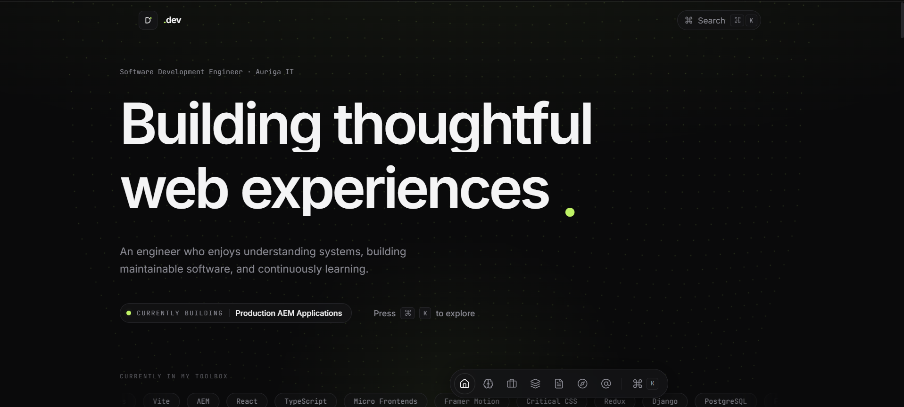

# dev — Portfolio

#### 🔗 [Visit Portfolio](https://kdev307.github.io/portfolio-v2)

An interaction-first portfolio built to feel like a product.

Built to explore the current capabilities of AI-assisted frontend development. This project experiments with rich interactions, animations, and 3D effects while using AI as a collaborative development tool, highlighting where engineering judgment and iterative refinement remain essential.


<!--  -->



## Run

Requires **Node 18+** (Vite 5). If `npm run dev` throws `crypto.getRandomValues is not a function`, your shell is on an old Node — run `nvm use 22` first.

```bash
npm install
npm run dev      # dev server
npm run build    # typecheck + production build → dist/
npm run preview  # serve the production build
```

## Routes

| Path         | Page                                           |
| ------------ | ---------------------------------------------- |
| `/`          | Home — single-scroll story (Landing → Contact) |
| `/work`      | All case studies (index)                       |
| `/work/:id`  | Full case-study article (`connect-4`, `woody`) |
| `/notes`     | All engineering notes (index)                  |
| `/notes/:id` | Full note                                      |

## Structure

```text
src/
├── components/
│   ├── background/      # Three.js background, spotlight
│   ├── command/         # Command palette, terminal, shortcuts
│   ├── layout/          # Header, dock, section wrappers, scroll utilities
│   ├── previews/        # Project and note preview cards
│   └── ui/              # Reusable UI components
│
├── data/                # Single source of truth for content
│   ├── profile.ts
│   ├── projects.ts
│   ├── notes.ts
│   └── exploring.ts
│
├── hooks/               # Custom React hooks
├── lib/                 # Shared utilities, motion variants, navigation
├── pages/               # Route-level pages
├── sections/            # Home page sections
├── assets/              # Static assets (if used)
├── styles/              # Global styles (if used)
├── App.tsx
└── main.tsx
```

## Interactions

- `⌘/Ctrl + K` — command palette (search sections, projects, actions)
- `G` home · `P` case studies · `C` contact · `?` shortcuts
- Mini terminal (in _How I Think_): `whoami`, `projects`, `experience`, `learning`, `resume`, `help`, `clear`
- Magnetic buttons, cursor-aware cards, mouse spotlight, animated dot-field background, scroll progress, floating dock, marquee, section reveals

Everything motion-heavy is gated behind `prefers-reduced-motion`.
