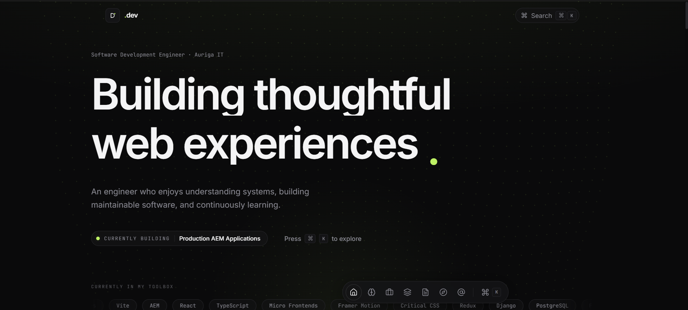

# dev — Portfolio

#### 🔗 [Visit Portfolio](https://kdev307.github.io/portfolio-v2)

An interaction-first portfolio built to feel like a product.

Built to explore the current capabilities of AI-assisted frontend development. This project experiments with rich interactions, animations, and 3D effects while using AI as a collaborative development tool, highlighting where engineering judgment and iterative refinement remain essential.


<!--  -->



## Run

Requires **Node 18+** (Vite 5). If `npm run dev` throws `crypto.getRandomValues is not a function`, your shell is on an old Node — run `nvm use 22` first.

```bash
npm install
npm run dev      # dev server
npm run build    # typecheck + production build → dist/
npm run preview  # serve the production build
```

## Routes

| Path         | Page                                           |
| ------------ | ---------------------------------------------- |
| `/`          | Home — single-scroll story (Landing → Contact) |
| `/work`      | All case studies (index)                       |
| `/work/:id`  | Full case-study article (`connect-4`, `woody`) |
| `/notes`     | All engineering notes (index)                  |
| `/notes/:id` | Full note                                      |

## Structure

```text
src/
├── components/
│   ├── background/      # Three.js background, spotlight
│   ├── command/         # Command palette, terminal, shortcuts
│   ├── layout/          # Header, dock, section wrappers, scroll utilities
│   ├── previews/        # Project and note preview cards
│   └── ui/              # Reusable UI components
│
├── data/                # Single source of truth for content
│   ├── profile.ts
│   ├── projects.ts
│   ├── notes.ts
│   └── exploring.ts
│
├── hooks/               # Custom React hooks
├── lib/                 # Shared utilities, motion variants, navigation
├── pages/               # Route-level pages
├── sections/            # Home page sections
├── assets/              # Static assets (if used)
├── styles/              # Global styles (if used)
├── App.tsx
└── main.tsx
```

## Interactions

- `⌘/Ctrl + K` — command palette (search sections, projects, actions)
- `G` home · `P` case studies · `C` contact · `?` shortcuts
- Mini terminal (in _How I Think_): `whoami`, `projects`, `experience`, `learning`, `resume`, `help`, `clear`
- Magnetic buttons, cursor-aware cards, mouse spotlight, animated dot-field background, scroll progress, floating dock, marquee, section reveals

## Animations & transitions

Motion is built almost entirely on **Framer Motion**, with a single **Three.js** ambient layer and a few **CSS** transitions/keyframes. A small set of shared primitives keeps the feel consistent across the whole site.

### Shared motion language (`src/lib/motion.ts`)

- **House easing** — one curve, `[0.22, 1, 0.36, 1]`, reused everywhere for a calm, product-grade feel.
- **`fadeUp`** — the default entrance: fade + 18px rise (0.6s). Used for nearly every block of content.
- **`stagger`** — orchestrates children with a 0.08s stagger so lists and grids cascade in.
- **`lineReveal`** — per-word/line reveal (rises from `0.4em`, indexed delay) — drives the hero headline.
- **`viewportOnce`** — the shared `whileInView` config (`once: true`, `-12%` margin) so sections animate in once as they enter view.

### Scroll-linked motion

- **Reveal-on-scroll** — sections and cards fade/rise in via `whileInView` + `fadeUp`, using motion values rather than re-renders.
- **Scroll progress** — the top progress bar and the back-to-top ring map `useScroll` → `useSpring` (`{ stiffness: 120, damping: 30, mass: 0.3 }`) onto `scaleX` / `pathLength`.
- **`useParallax` hook (`src/hooks/useParallax.ts`)** — a reusable `useScroll` + `useTransform` + `useSpring` translate for any decorative layer; pins to `0` under reduced motion.
- **Parallax watermarks (`ParallaxWord`)** — the oversized, dot-textured lime section words (`THINK`, `BUILD`, `WORK`, …). On desktop they drift horizontally across the full scroll pass — direction alternates per section (`left` ⇄ `right`) and reverses as you scroll back up — with a brief opacity fade-in. On mobile/tablet they render static in the bottom-right. Layered behind all content (`z-0` watermark under a `z-10` foreground) and kept low-contrast so copy always wins.

### Ambient & pointer effects

- **Three.js dot field (`ThreeBackground`)** — a travelling-wave point cloud with gentle pointer parallax; paused off-screen via `IntersectionObserver` and reduced to a single static frame under reduced motion.
- **Mouse spotlight** — a radial glow tracking the cursor through CSS variables updated on `requestAnimationFrame`.
- **Magnetic buttons / tilt cards** — ref-driven pointer interactions (`useMagnetic`, `useTilt`) that write transforms via rAF, no React re-renders.
- **Custom cursor** — a dot + ring that scale on interactive elements via CSS transitions.

### CSS transitions & keyframes

- **Keyframes** (Tailwind config): `marquee` (infinite tech ticker), `fade-up`, `pulse-dot` (status indicator), plus a `shimmer` sweep on skeleton loaders.
- **Utility transitions** — hover/focus color, border, and transform transitions (≈0.3s) on links, cards, and social tiles.
- **Route/page** — `overflow-clip` sections and `scroll-behavior: smooth` for anchor navigation.

### Accessibility

Everything motion-heavy is gated behind **`prefers-reduced-motion`** — via the `usePrefersReducedMotion` hook (JS-driven animations fall back to static/first-frame) and a global CSS killswitch that near-zeroes animation and transition durations. The parallax watermarks are additionally static below the desktop breakpoint regardless of motion preference.
